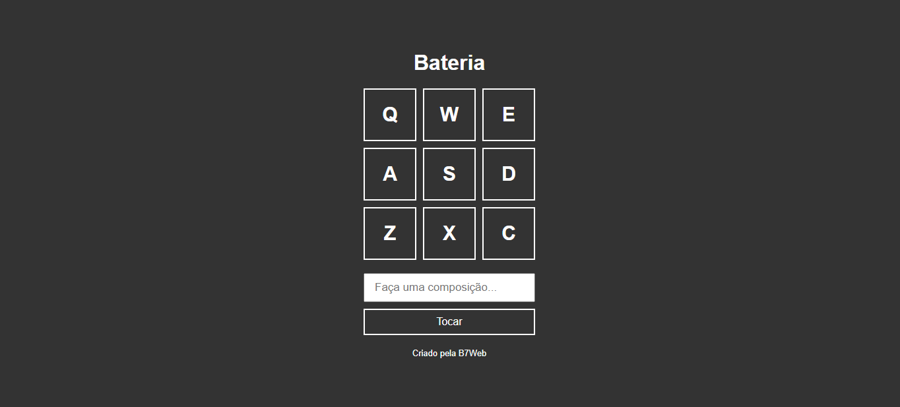
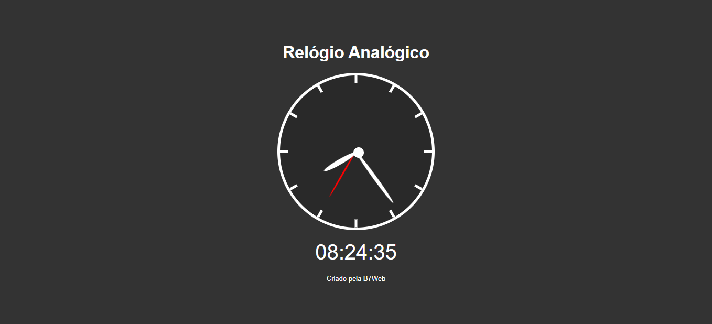
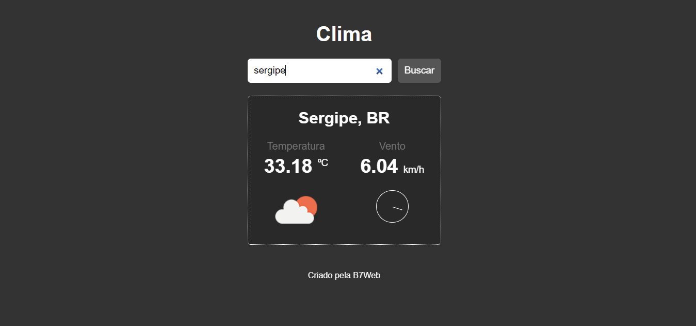
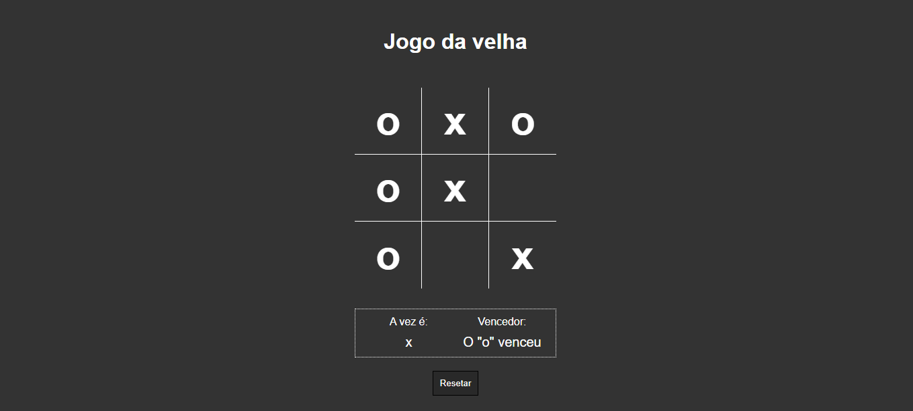
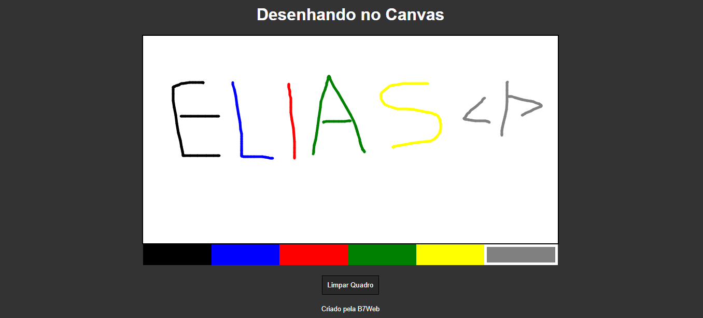

<h1 align="center">
  &nbsp;&nbsp;&nbsp;
  &nbsp;&nbsp;&nbsp;
  
</h1>

<h3 align="center">
  Desafio 7 Projetos em 7 Dias
</h3>

Vamos criar 1 projeto por dia, do zero, em javascript, durante 7 dias

Por Bonieky Lacerda - B7Web

  <a href="#como-executar-o-projeto">Como executar cada projeto</a>&nbsp;&nbsp;&nbsp;|&nbsp;&nbsp;
  <a href="#desafios">Desafios</a>

## Como executar o projeto

- Execute `git clone https://github.com/eliasmcastro/b7web-desafio-js-7-projetos-em-7-dias.git` para clonar este repositório
- Abra os arquivos HTML que estão dentro de cada pasta no seu navegador de preferência para ver o resultado

## Desafios

<table align="center">
  <thead>
    <tr>
      <th>
         
        
<small>#</small>

      </th>
      <th>
         
        
<small>NOME</small>

      </th>
      <th align="center">
        
        
<small>PREVIEW</small>

      </th>
    </tr>
  </thead>
  <tbody>
    <tr>
      <td align="center">
        01
      </td>
      <td align="center">
        <a href="01-bateria">Bateria</a>
        
Simulador de uma bateria

      </td>
      <td align="center">
        
      </td>
    </tr>
    <tr>
      <td align="center">
        02
      </td>
      <td align="center">
        <a href="02-relogio">Relógio</a>
        
Relógio analógico e digital

      </td>
      <td align="center">
        
      </td>
    </tr>
    <tr>
      <td align="center">
        03
      </td>
      <td align="center">
        <a href="03-clima">Clima</a>
        
Exibe informações do clima

        
Criar uma conta no <a href="https://openweathermap.org" target="_blank">openweathermap</a> para utilizar a API

      </td>
      <td align="center">
        
      </td>
    </tr>
    <tr>
      <td align="center">
        04
      </td>
      <td align="center">
        <a href="04-jogo-da-velha">Jogo da Velha</a>
        
Clássico jogo da velha

      </td>
      <td align="center">
        
      </td>
    </tr>
    <tr>
      <td align="center">
        05
      </td>
      <td align="center">
        <a href="05-quadrado-desenho">Quadrado de Desenho</a>
        
Desenhando no Canvas

      </td>
      <td align="center">
        
      </td>
    </tr>
  </tbody>
</table>
